# Arquitectura de los 6 Módulos - Facturador Electrónico SV

**Versión:** 1.0  
**Fecha:** 7 de febrero de 2026  
**Proyecto:** Facturador Electrónico SV - Republicode

---

## 📐 Visión General del Sistema

Este documento describe la arquitectura de 6 módulos nuevos que transformarán Facturador SV de una herramienta de emisión de DTEs a una plataforma ERP completa para PyMEs salvadoreñas.

### Stack Tecnológico

```
┌─────────────────────────────────────────────────────────┐
│                    FRONTEND (Next.js 14)                │
│  shadcn/ui • Tailwind CSS • React Hook Form • Zod      │
│  TanStack Query • Fuse.js • React Spreadsheet Import   │
└─────────────────────────────────────────────────────────┘
                            ↕ REST API
┌─────────────────────────────────────────────────────────┐
│                    BACKEND (NestJS)                     │
│  Prisma ORM • class-validator • BullMQ • XState        │
│  JWT • bcrypt • JWS (firma DTEs) • Azure SDK           │
└─────────────────────────────────────────────────────────┘
                            ↕
┌──────────────┬──────────────┬──────────────┬───────────┐
│  Azure SQL   │    Redis     │ Azure Blob   │ Ministerio│
│   Database   │  (BullMQ)    │   Storage    │    MH     │
└──────────────┴──────────────┴──────────────┴───────────┘
```

---

## 🗂️ MÓDULO 1: Catálogo de Inventarios

### Arquitectura de Componentes

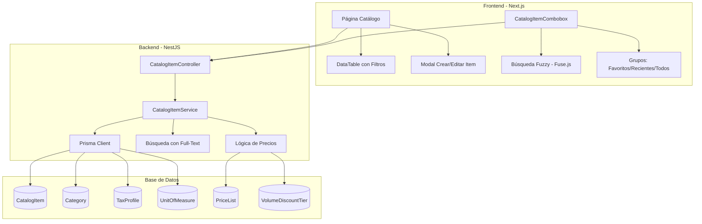

### Flujo de Resolución de Precios

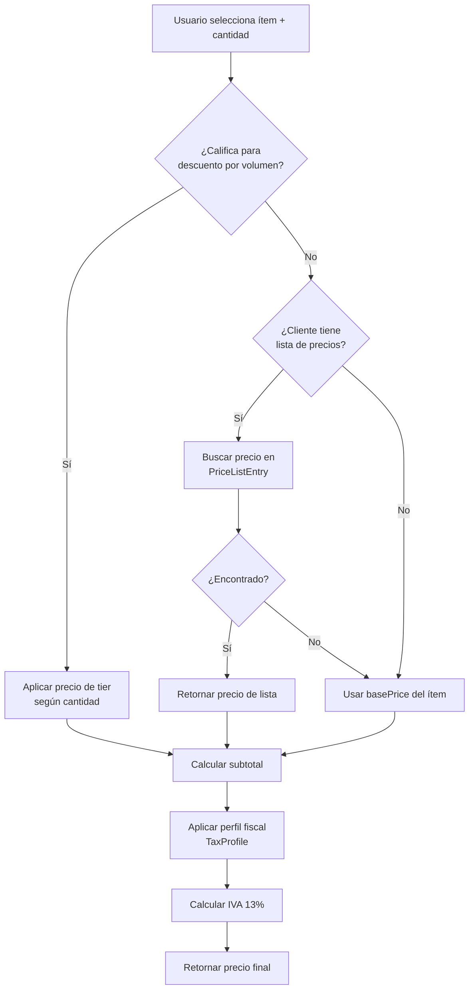

### Endpoints API Críticos

```typescript
// GET /api/catalog-items
// Query params: search, type, category, isActive, limit, offset
// Response: { items: CatalogItem[], total: number }

// GET /api/catalog-items/search?q=laptop&limit=20
// Búsqueda fuzzy optimizada
// Response: CatalogItem[] ordenados por relevancia

// GET /api/catalog-items/recent
// Retorna últimos 10 usados del tenant
// Response: CatalogItem[] ordenados por lastUsedAt DESC

// POST /api/catalog-items/:id/favorite
// Toggle favorito
// Response: { isFavorite: boolean }

// POST /api/catalog-items
// Body: CreateCatalogItemDto
// Validaciones: código único, precio > 0, unidad válida
```

### Modelo de Datos (Schema Prisma)

```prisma
model CatalogItem {
  id                 String    @id @default(uuid())
  tenantId           String
  type               ItemType  // PRODUCT | SERVICE
  code               String    // SKU único por tenant
  name               String
  tipoItem           Int       @default(1) // CAT-011
  basePrice          Decimal   @db.Decimal(12,2)
  taxProfileId       String?
  isTrackedInventory Boolean   @default(false)
  quantityOnHand     Decimal   @default(0)
  baseUnitId         String?
  isFavorite         Boolean   @default(false)
  usageCount         Int       @default(0)
  lastUsedAt         DateTime?
  
  @@unique([tenantId, code])
  @@index([tenantId, usageCount(sort: Desc)])
}
```

---

## 📅 MÓDULO 2: Facturación Recurrente

### Arquitectura de Jobs Asíncronos con BullMQ

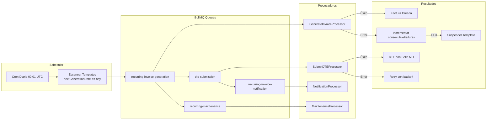

### Máquina de Estados del Template

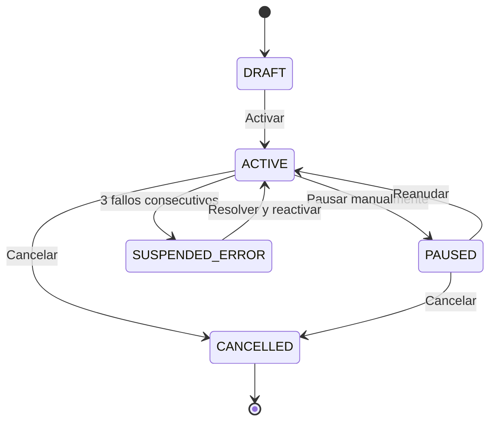

### Normalización de Día del Mes

```typescript
// Lógica para día 31 en meses sin 31 días
function calculateNextGenerationDate(
  template: RecurringInvoiceTemplate,
  currentDate: Date
): Date {
  const { interval, intervalCount, anchorDay, dayOfMonthPolicy } = template;
  
  if (interval === 'MONTHLY') {
    const nextMonth = addMonths(currentDate, intervalCount);
    
    if (dayOfMonthPolicy === 'LAST_DAY') {
      return endOfMonth(nextMonth);
    }
    
    if (dayOfMonthPolicy === 'EXACT' && anchorDay) {
      const lastDayOfMonth = getDaysInMonth(nextMonth);
      const targetDay = Math.min(anchorDay, lastDayOfMonth);
      return setDate(nextMonth, targetDay);
    }
  }
  
  // ... otras lógicas de interval
}
```

### Manejo de Errores en 3 Niveles

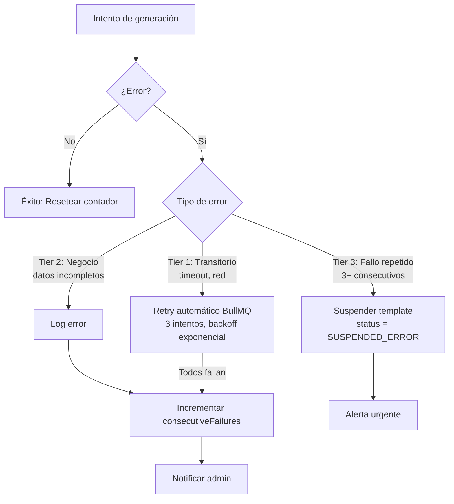

### Modelo de Datos

```prisma
model RecurringInvoiceTemplate {
  id                    String    @id @default(uuid())
  tenantId              String
  clientId              String
  interval              RecurringInterval @default(MONTHLY)
  intervalCount         Int       @default(1)
  anchorDay             Int?      // 1-31
  dayOfMonthPolicy      DayOfMonthPolicy @default(EXACT)
  nextGenerationDate    DateTime
  generationMode        GenerationMode @default(AUTO_DRAFT)
  status                RecurringTemplateStatus @default(ACTIVE)
  consecutiveFailures   Int       @default(0)
  suspendAfterFailures  Int       @default(3)
  lastErrorMessage      String?
  
  @@index([tenantId, status, nextGenerationDate])
}
```

---

## 💬 MÓDULO 3: Sistema de Cotizaciones

### Máquina de Estados Completa (XState v5)

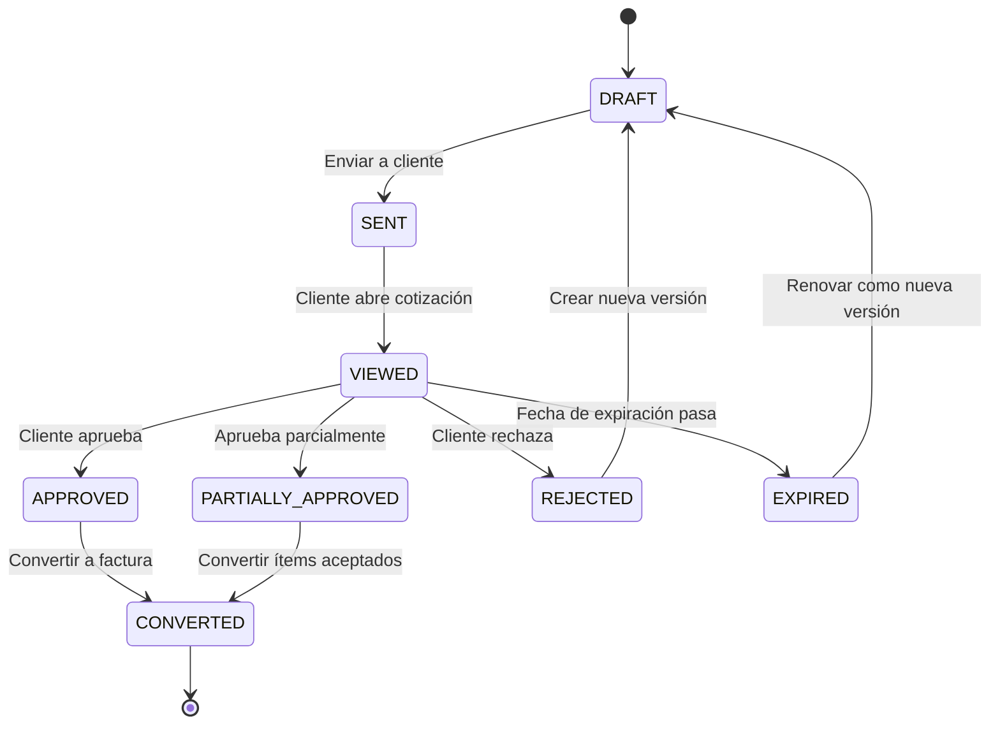

### Flujo de Versionamiento

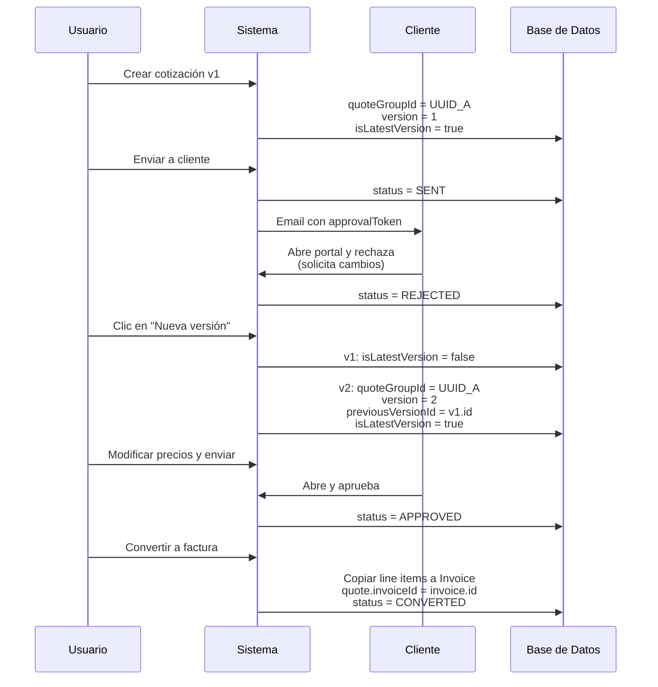

### Portal de Aprobación del Cliente

```typescript
// Ruta pública: /quote/approve/[token]
// No requiere login, validación por UUID token

interface ClientApprovalPortal {
  // Datos de la cotización
  quote: {
    quoteNumber: string;
    issueDate: Date;
    validUntil: Date;
    companyBranding: {
      logo: string;
      name: string;
      colors: { primary: string };
    };
    lineItems: QuoteLineItem[];
    subtotal: number;
    taxAmount: number;
    total: number;
  };
  
  // Acciones disponibles
  actions: {
    approve: () => Promise<void>;
    reject: (reason: string) => Promise<void>;
    requestChanges: (comments: string) => Promise<void>;
    toggleLineItemAcceptance: (itemId: string) => void;
    updateAcceptedQuantity: (itemId: string, qty: number) => void;
  };
}
```

### Conversión a Factura

```typescript
async function convertQuoteToInvoice(
  quoteId: string,
  userId: string
): Promise<Invoice> {
  // Validaciones
  const quote = await getQuote(quoteId);
  if (!['APPROVED', 'PARTIALLY_APPROVED'].includes(quote.status)) {
    throw new Error('Solo se pueden convertir cotizaciones aprobadas');
  }
  
  // Filtrar solo ítems aceptados (para aprobación parcial)
  const acceptedItems = quote.lineItems.filter(item => item.isAccepted === true);
  
  // Crear factura
  const invoice = await prisma.invoice.create({
    data: {
      tenantId: quote.tenantId,
      clientId: quote.clientId,
      sourceQuoteId: quote.id,
      issueDate: new Date(),
      lineItems: {
        create: acceptedItems.map(item => ({
          catalogItemId: item.catalogItemId,
          description: item.description,
          quantity: item.acceptedQuantity ?? item.quantity,
          unitPrice: item.unitPrice,
          discount: item.discount,
          taxRate: item.taxRate,
        }))
      },
      // ... calcular totales
    }
  });
  
  // Actualizar cotización
  await prisma.quote.update({
    where: { id: quoteId },
    data: {
      status: 'CONVERTED',
      convertedToInvoiceAt: new Date(),
      invoiceId: invoice.id,
    }
  });
  
  return invoice;
}
```

---

## 📥 MÓDULO 4: Migración de Datos Históricos

### Pipeline de Importación en 6 Etapas

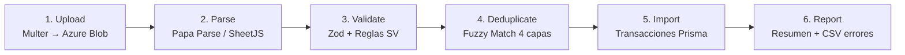

### Estrategia de Deduplicación en 4 Capas

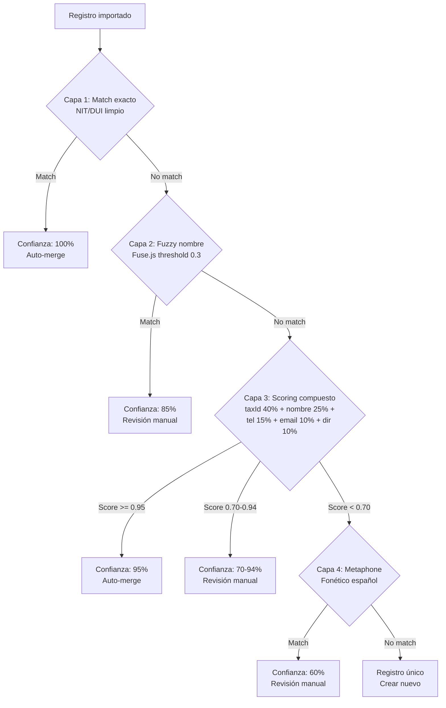

### Wizard UI en 8 Pasos

```typescript
// Usando react-spreadsheet-import
import { ReactSpreadsheetImport } from "react-spreadsheet-import";

const steps = [
  {
    step: 1,
    name: "Selección de Entidad",
    description: "¿Qué tipo de datos vas a importar?",
    options: ["Clientes", "Productos", "Facturas Históricas"]
  },
  {
    step: 2,
    name: "Upload de Archivo",
    acceptedFormats: [".csv", ".xlsx", ".xls"],
    maxSize: "10MB"
  },
  {
    step: 3,
    name: "Preview de Datos",
    showRawData: true,
    showRowCount: true
  },
  {
    step: 4,
    name: "Mapeo de Columnas",
    autoDetect: true, // Usa Levenshtein distance
    requiredFields: ["nombre", "nit", "correo"],
    optionalFields: ["telefono", "direccion"]
  },
  {
    step: 5,
    name: "Validación",
    showErrors: true,
    showWarnings: true,
    allowInlineEdit: true,
    validations: [
      { field: "nit", validator: validateSalvadoranNIT },
      { field: "correo", validator: z.string().email() }
    ]
  },
  {
    step: 6,
    name: "Resolución de Duplicados",
    duplicateStrategy: ["skip", "merge", "createNew"],
    showSimilarityScore: true
  },
  {
    step: 7,
    name: "Ejecución",
    showProgressBar: true,
    useWebSocket: true, // Actualizaciones en tiempo real
    batchSize: 500
  },
  {
    step: 8,
    name: "Resumen",
    showStats: true,
    allowDownloadErrors: true,
    errorFormat: "CSV"
  }
];
```

### Validación de Identificadores Salvadoreños

```typescript
// Validador de NIT (14 dígitos con formato XXXX-XXXXXX-XXX-X)
function validateSalvadoranNIT(nit: string): boolean {
  // Limpiar formato
  const cleaned = nit.replace(/-/g, '');
  
  if (cleaned.length !== 14) return false;
  if (!/^\d+$/.test(cleaned)) return false;
  
  // Extraer partes
  const municipio = cleaned.substring(0, 4);
  const fecha = cleaned.substring(4, 10); // DDMMYY
  const correlativo = cleaned.substring(10, 13);
  const verificador = cleaned.substring(13, 14);
  
  // Validar dígito verificador (algoritmo específico)
  const calculatedVerifier = calculateNITVerifier(cleaned.substring(0, 13));
  return calculatedVerifier === verificador;
}

// Validador de DUI (9 dígitos con formato XXXXXXXX-X)
function validateSalvadoranDUI(dui: string): boolean {
  const cleaned = dui.replace(/-/g, '');
  
  if (cleaned.length !== 9) return false;
  if (!/^\d+$/.test(cleaned)) return false;
  
  // Algoritmo de verificación DUI
  const weights = [3, 7, 1, 9, 0, 2, 4, 8];
  let sum = 0;
  for (let i = 0; i < 8; i++) {
    sum += parseInt(cleaned[i]) * weights[i];
  }
  const remainder = sum % 10;
  const checkDigit = remainder === 0 ? 0 : 10 - remainder;
  
  return checkDigit === parseInt(cleaned[8]);
}

// Validador de NRC (formato variable)
function validateSalvadoranNRC(nrc: string): boolean {
  const cleaned = nrc.replace(/-/g, '');
  const pattern = /^\d{1,7}-?\d$/;
  return pattern.test(nrc);
}
```

---

## 💰 MÓDULO 5: Módulo Contable Básico

### Generación Automática de Partidas

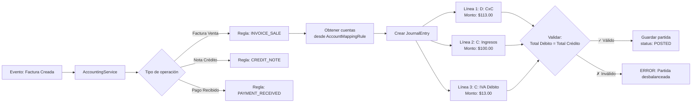

### Estructura de Partida Doble

```typescript
interface JournalEntryExample {
  // Factura de Venta por $100.00 + IVA 13%
  entryNumber: "PD-2026-000001";
  entryDate: "2026-02-07";
  description: "Factura de venta #FE-0001";
  entryType: "AUTOMATIC";
  sourceType: "FACTURA";
  sourceDocumentId: "invoice-uuid-123";
  
  lines: [
    {
      account: { code: "1103", name: "Cuentas por Cobrar" },
      debit: 113.00,
      credit: 0,
      description: "Factura FE-0001 - Cliente ABC"
    },
    {
      account: { code: "5101", name: "Ingresos por Ventas" },
      debit: 0,
      credit: 100.00,
      description: "Venta de productos"
    },
    {
      account: { code: "2106", name: "IVA Débito Fiscal" },
      debit: 0,
      credit: 13.00,
      description: "IVA 13% sobre $100.00"
    }
  ];
  
  totalDebit: 113.00;  // Debe ser igual
  totalCredit: 113.00; // Debe ser igual
}
```

### Reglas de Mapeo Automático

```typescript
// Configuración por tenant
const defaultAccountMappingRules = [
  {
    operationType: "INVOICE_SALE",
    mappings: [
      { account: "1103", movementType: "DEBIT", description: "Cuentas por Cobrar" },
      { account: "5101", movementType: "CREDIT", description: "Ingresos por Ventas" },
      { account: "2106", movementType: "CREDIT", description: "IVA Débito Fiscal" }
    ]
  },
  {
    operationType: "CREDIT_NOTE",
    mappings: [
      { account: "5101", movementType: "DEBIT", description: "Reversa Ingresos" },
      { account: "2106", movementType: "DEBIT", description: "Reversa IVA Débito" },
      { account: "1103", movementType: "CREDIT", description: "Reversa CxC" }
    ]
  },
  {
    operationType: "PAYMENT_RECEIVED",
    mappings: [
      { account: "1101", movementType: "DEBIT", description: "Efectivo/Banco" },
      { account: "1103", movementType: "CREDIT", description: "Cuentas por Cobrar" }
    ]
  }
];
```

### Exportación a Excel

```typescript
import * as ExcelJS from 'exceljs';

async function exportLibroDiario(
  tenantId: string,
  startDate: Date,
  endDate: Date
): Promise<Buffer> {
  const workbook = new ExcelJS.Workbook();
  const worksheet = workbook.addWorksheet('Libro Diario');
  
  // Headers
  worksheet.columns = [
    { header: 'Fecha', key: 'date', width: 12 },
    { header: 'No. Partida', key: 'entryNumber', width: 15 },
    { header: 'Código Cuenta', key: 'accountCode', width: 12 },
    { header: 'Nombre Cuenta', key: 'accountName', width: 30 },
    { header: 'Concepto', key: 'description', width: 40 },
    { header: 'Debe', key: 'debit', width: 12 },
    { header: 'Haber', key: 'credit', width: 12 },
  ];
  
  // Fetch data
  const entries = await prisma.journalEntry.findMany({
    where: {
      tenantId,
      entryDate: { gte: startDate, lte: endDate },
      status: 'POSTED'
    },
    include: {
      lines: {
        include: { account: true }
      }
    },
    orderBy: { entryDate: 'asc' }
  });
  
  // Populate rows
  for (const entry of entries) {
    for (const line of entry.lines) {
      worksheet.addRow({
        date: entry.entryDate,
        entryNumber: entry.entryNumber,
        accountCode: line.account.code,
        accountName: line.account.name,
        description: line.description || entry.description,
        debit: line.debit > 0 ? line.debit : null,
        credit: line.credit > 0 ? line.credit : null,
      });
    }
    // Línea en blanco entre partidas
    worksheet.addRow({});
  }
  
  // Styling
  worksheet.getRow(1).font = { bold: true };
  worksheet.getRow(1).fill = {
    type: 'pattern',
    pattern: 'solid',
    fgColor: { argb: 'FFE0E0E0' }
  };
  
  // Number formatting
  worksheet.getColumn('debit').numFmt = '$#,##0.00';
  worksheet.getColumn('credit').numFmt = '$#,##0.00';
  
  return await workbook.xlsx.writeBuffer();
}
```

---

## 🔗 MÓDULO 6: Sistema de Webhooks

### Arquitectura de Entregas con Reintentos

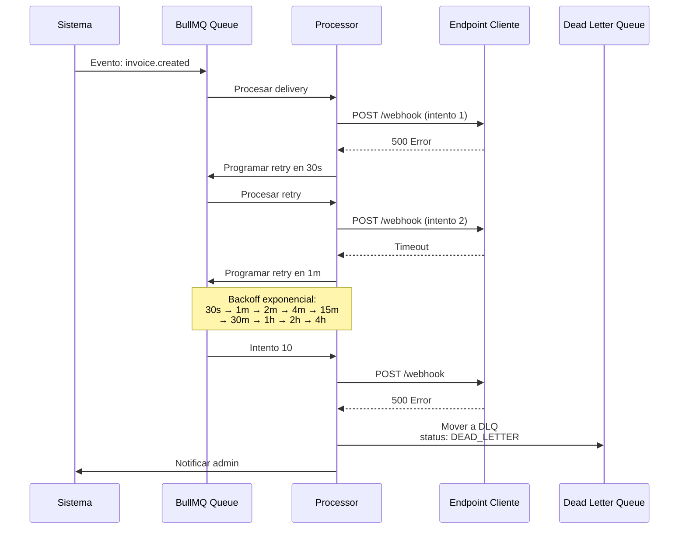

### Seguridad: Firma HMAC-SHA256

```typescript
import * as crypto from 'crypto';

function generateWebhookSignature(
  payload: string,
  secret: string,
  webhookId: string,
  timestamp: number
): string {
  // Construir string a firmar: {id}.{timestamp}.{payload}
  const signedContent = `${webhookId}.${timestamp}.${payload}`;
  
  // Generar firma HMAC-SHA256
  const hmac = crypto.createHmac('sha256', secret);
  hmac.update(signedContent);
  const signature = hmac.digest('hex');
  
  return signature;
}

// Verificación en el cliente
function verifyWebhookSignature(
  payload: string,
  receivedSignature: string,
  secret: string,
  webhookId: string,
  timestamp: number
): boolean {
  // Validar timestamp (no más de 5 minutos de diferencia)
  const now = Math.floor(Date.now() / 1000);
  if (Math.abs(now - timestamp) > 300) {
    throw new Error('Webhook timestamp too old (replay attack prevention)');
  }
  
  // Recalcular firma esperada
  const expectedSignature = generateWebhookSignature(
    payload,
    secret,
    webhookId,
    timestamp
  );
  
  // Comparación timing-safe
  return crypto.timingSafeEqual(
    Buffer.from(receivedSignature),
    Buffer.from(expectedSignature)
  );
}
```

### Payload con Partidas Contables Embebidas

```typescript
interface WebhookPayload {
  // Metadata del evento
  id: string;               // "evt_2kXhG7nR4mP8qLs"
  type: string;             // "invoice.paid"
  api_version: string;      // "2025-01-15"
  tenant_id: string;
  
  // Objeto del recurso
  data: {
    object: {
      id: string;
      codigo_generacion: string;
      sello_recepcion: string;
      client: {
        id: string;
        nombre: string;
        nit: string;
      };
      line_items: Array<{
        description: string;
        quantity: number;
        unit_price: number;
        total: number;
      }>;
      subtotal: number;
      tax_amount: number;
      total: number;
      
      // ⭐ Partidas contables listas para consumir
      journal_entries: Array<{
        entry_number: string;
        entry_date: string;
        description: string;
        lines: Array<{
          account_code: string;
          account_name: string;
          debit: number;
          credit: number;
        }>;
        total_debit: number;
        total_credit: number;
      }>;
    };
    
    // Atributos anteriores (para eventos de actualización)
    previous_attributes?: Partial<typeof object>;
  };
  
  // Metadata adicional
  created: number;          // Unix timestamp
}
```

### Dashboard de Monitoreo

```typescript
interface WebhookDashboardMetrics {
  // Métricas de salud por endpoint
  endpoints: Array<{
    id: string;
    url: string;
    isActive: boolean;
    
    // Últimas 24 horas
    metrics: {
      totalDeliveries: number;
      successfulDeliveries: number;
      failedDeliveries: number;
      successRate: number;        // Porcentaje
      avgResponseTime: number;    // Milisegundos
      p95ResponseTime: number;
    };
    
    // Estado actual
    consecutiveFailures: number;
    lastSuccessAt: Date | null;
    lastFailureAt: Date | null;
    lastError: string | null;
  }>;
  
  // Dead Letter Queue
  deadLetterQueue: {
    count: number;
    oldestEvent: Date | null;
    recentEvents: Array<{
      eventId: string;
      eventType: string;
      attempts: number;
      lastError: string;
      createdAt: Date;
    }>;
  };
  
  // Gráfico de entregas (últimos 7 días)
  deliveryChart: Array<{
    date: string;
    successful: number;
    failed: number;
    retried: number;
  }>;
}
```

---

## 🔄 Flujos de Integración End-to-End

### Flujo Completo: Factura Recurrente → DTE → Contabilidad → Webhook

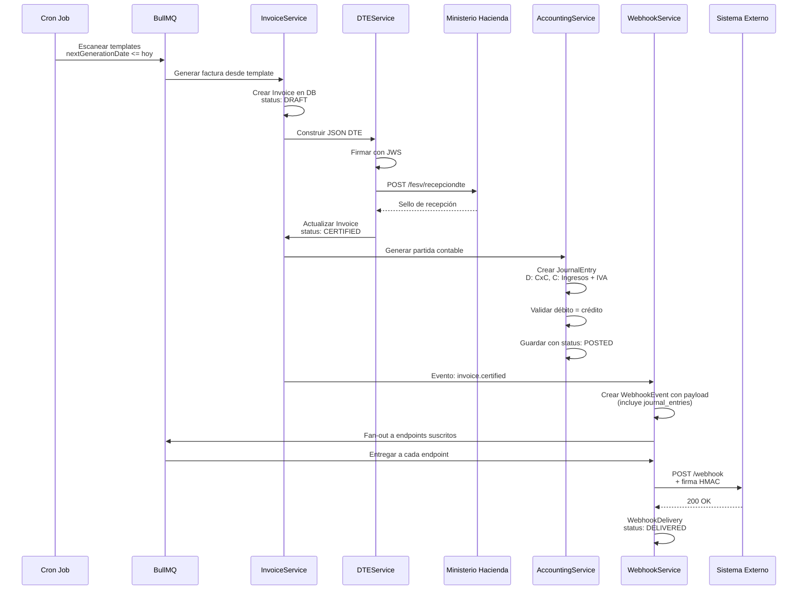

---

## 📊 Métricas de Éxito del Sistema

### KPIs por Módulo

| Módulo | Métrica Clave | Target | Medición |
|--------|---------------|--------|----------|
| **Catálogo** | Tiempo de búsqueda | <100ms | Latencia p95 de búsqueda fuzzy |
| **Catálogo** | Precisión de búsqueda | >90% | Relevancia de primeros 5 resultados |
| **Recurrente** | Tasa de éxito generación | >99% | (Facturas exitosas / Total intentos) × 100 |
| **Recurrente** | Tiempo de recuperación | <5min | Desde fallo hasta retry exitoso |
| **Cotizaciones** | Tasa de conversión | >60% | (Cotizaciones convertidas / Total enviadas) × 100 |
| **Cotizaciones** | Tiempo de aprobación | <24h | Mediana desde SENT hasta APPROVED |
| **Migración** | Tasa de validación | >95% | (Registros válidos / Total) × 100 |
| **Migración** | Precisión deduplicación | >98% | (Matches correctos / Total matches) × 100 |
| **Contable** | Balance perfecto | 100% | Partidas con débito = crédito |
| **Contable** | Tiempo de generación | <500ms | Latencia p95 de generación automática |
| **Webhooks** | Tasa de entrega | >99% | (Entregas exitosas / Total eventos) × 100 |
| **Webhooks** | Latencia de entrega | <5s | Tiempo desde evento hasta primera entrega |

---

## 🚀 Estrategia de Deploy y Rollout

### Despliegue por Fases

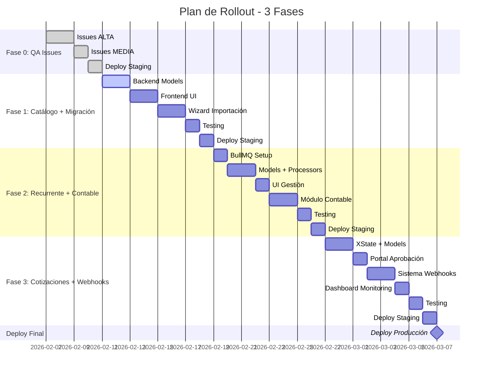

### Feature Flags por Módulo

```typescript
// Configuración de feature flags en base de datos
interface TenantFeatureFlags {
  catalogEnabled: boolean;           // Fase 1
  dataImportEnabled: boolean;        // Fase 1
  recurringInvoicesEnabled: boolean; // Fase 2
  accountingModuleEnabled: boolean;  // Fase 2
  quotesEnabled: boolean;            // Fase 3
  webhooksEnabled: boolean;          // Fase 3
}

// Middleware para validar acceso
async function validateFeatureAccess(
  tenantId: string,
  feature: keyof TenantFeatureFlags
): Promise<boolean> {
  const tenant = await prisma.tenant.findUnique({
    where: { id: tenantId },
    select: { featureFlags: true }
  });
  
  return tenant?.featureFlags[feature] ?? false;
}
```

---

**Última actualización:** 7 de febrero de 2026  
**Próxima revisión:** Después de completar FASE 1
